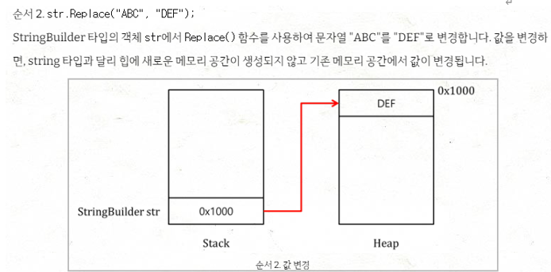

# String 
string 타입은 문자열 타입을 저장 할 수 있는 변수타입으로, 문자열이 변경 될 때 마다 변경된 문자열을 새로운 string 타입 객체를 생성에 힙에 할당한다.<br> 
그렇다면 힙이 위치하는 메모리 공간들을 알아보고 메모리 할당을 최적화 할 수 있는 방법은 무엇이 있을까

## 메모리 공간

 <br>
- 코드영역 : 실행할 프로그램의 코드가 저장되는 영역으로, 텍스트 영역이라고도 부른다. CPU는 코드 영역에 저장된 명령어를 하나씩 처리한다.
- 데이터 영역 : 프로그램의 전역 변수와 정적 변수가 저장되는 역역으로 프로그램이 종료되면 소멸한다.
- 스택 영역 : 함수의 호출과 관계되는 지역변수와 매개변수가 저장되는 영역으로, 함수의 호출과 함께 할당되고 호출 완료시 소멸한다. 스택 영역에 저장되는 함수의 호출 정보를 스택 프레임이라고 한다.  <br> 스택 영역은 푸시동작으로 데이터를 저장하고 팝 동작으로 데이터를 인출하는 후입선출 방식에 따라 가장 늦게 저장된 데이터가 가장 먼저 인출되는 `후입선출` 방식으로 동작하며, 메모리의 높은 주소에서 낮은 주소의 방향으로 할당된다.
- 힙 영역 : 사용자가 직접 관리 할 수 있는 영역이며 관리 해야만 하는 영역이다.  사용자에 의해 메모리 공간이 동적으로 할당되고 해제되며 메모리의 낮은 주소에서 높은 주소 방향으로 할당된다.

### 스택과 힙

- 스택 : 매우 빠른 액세스를 보장하며, 변수를 명시적으로 할당 해제 할 필요가 없다. 지역변수만 할당 가능하며 변수 크기를 조절 할 수 없고 스택 크기에 제한이 있다. CPU에 의해 효율적으로 관리되어 메모리 단편화가 없다.
- 힙 : 변수를 전역적으로 액세스하며 메모리 크기에 제한이 없다. 하지만 스택에 비해 액세스가 느리고 변수를 할당하고 해제해야하는 책임이 사용자에게 있어 메모리 단편화 가능성이 있다.
  
## 가변과 불변

정수형인 int는 값타입이며 가변 타입이다. 


```C#
static void Main(String[] args)
{
    int a = 100;
    int b = a;
    a = 300;

    Console.WriteLine($"a : {a}"); // 300 출력
    Console.WriteLine($"b : {b}"); // 100 출력
}
```
데이터 변경시 새로운 메모리 할당이 일어나지 않으며 이미 생성된 메모리가 변경된다.


반면에 string은 불변 타입이다. 


```C#
static void Main(string[] args)
{
    string s1 = "Hello World";
    string s2 = s1;

    s1 = "World Hello";

    Console.WriteLine($"s1 : {s1}"); // World Hello 출력
    Console.WriteLine($"s2 : {s2}"); // Hello World 출력
}

```
 <br>


같은 메모리 주소 내에서 값만 변경하는 값타입과는 다르게 참조타입은 매번 메모리 할당이 일어난다.<br>

데이터 변경시 String 또한 가변 처럼 보인다. 하지만 사실은 데이터를 변경 할 때 마다 내부적으로 메모리 할당이 새로 일어나서 string을 많이 변경하면 메모리에 오버헤드가 발생한다. String은 문자열의 크기를 특정 할 수 없어 정해진 크기만을 할당받는 스택 영역에 저장이 불가능하기 때문에 힙 영역에 동적할당을 진행하는데 새로운 문자열을 할당하려면 불변성의 특징 때문에 추가적인 할당과정을 진행해야 한다.

 이와같이 게임에서 대량의 문자열을 처리할때, 이러한 최적화되지 않은 문자열 처리방식을 사용한다면 게임의 로딩시간을 늘리며 사용자 데이터를 처리하는데도 문자열 정보가 필요하기 때문에 데이터 보안 문제도 발생 할 수 있다.


## StringBuilder
문자열의 반복적인 힙 메모리 할당을 줄여 최적화 할 수 있는 방안

```C#
using System.Text;
static void Main()
{
    StringBuilder sb = new StringBuilder();
    StringBuilder sb2 = new StringBuilder();

    sb.Append("참조타입이며 ");
    sb2 = sb;
    sb.Append("가변형이다.");

    Console.WriteLine($"sb : {sb}");
    Console.WriteLine($"sb2 : {sb2}");

    sb.Remove(0,13);
    sb.Append("가변형이며 참조타입이다.");
    Console.WriteLine($"sb : {sb}");
}
```


StringBuilder는 String과는 달리 sb2가 sb의 주소를 참조하게 하여 같은 주소를 가르키게 된다. 이는 힙메모리에 추가적인 할당을 만들지 않고 문자열을 변경할 시 기존에 참조하는 메모리의 실제 내용이 변경된다.

 <br>

 <br>


이처럼 StringBuilder를 사용하면 문자열 처리를 최적화 할 수 있으며 이는 string과는 달리 다양한 언어 환경에서도 우수한 성능을 제공해 사용자 경험을 향상시킬 수 있다.

# Record

Record는 C# 9.0에서 추가된 사용자 정의 타입을 생성할 수 있는 방법으로 객체 멤버가 변하지 않는 Immutable 참조 타입을 만들기 위한 타입이다.<br>
값 타입의 객체는 다른 객체에 할당할 때 깊은 복사를 수행하는데 이는 모든 필드를 1:1로 비교해야 하는 불변객체에 필요한 방법이다. 하지만 필드가 많을수록 복사 비용이 커지고, 오버헤드가 존재한다는 단점이 있다.<br>
참조타입은 오버헤드가 없다는 장점이 있으나, 깊은복사를 제공하지 않아 프로그래머가 직접 구현해야 한다.
<br>
각각의 두 타입의 장점인 값 타입처럼 깊은 복사가 필요하면서 참조형식의 비용 효율을 가지는 객체가 필요할 때 Record를 사용한다.

## Record 사용

- Record 선언
```c#
record Character
{
    public string firstName { get; init; }
    public string lastName { get; init; }
}
```
- 인스턴스 선언과 레코드 복사
```c#
 //인스턴스 선언
 Character player1 = new Character { firstName = "Jamie", lastName = "Siu" };
 Character player2 = new Character { firstName = "Luke", lastName = "Sullivan" };

 //레코드 복사
 //with 복사 생성자를 이용하여 레코드를 복사하고 fistName만 수정하여 인스턴스를 생성한다.
 Character player3= player1 with { firstName = "Janie"};


 Console.WriteLine($"{player3.firstName}"); // Janie 출력
 Console.WriteLine($"{player3.lastName}"); // Siu 출력
```

- 레코드 비교
```c#
     //레코드 비교
     //Equals 메서드를 사용해 두 인스턴스가 같으면 True, 다르면 Fasle를 리턴한다.
     Console.WriteLine(player1.Equals(player3)); // False 출력
     
```
